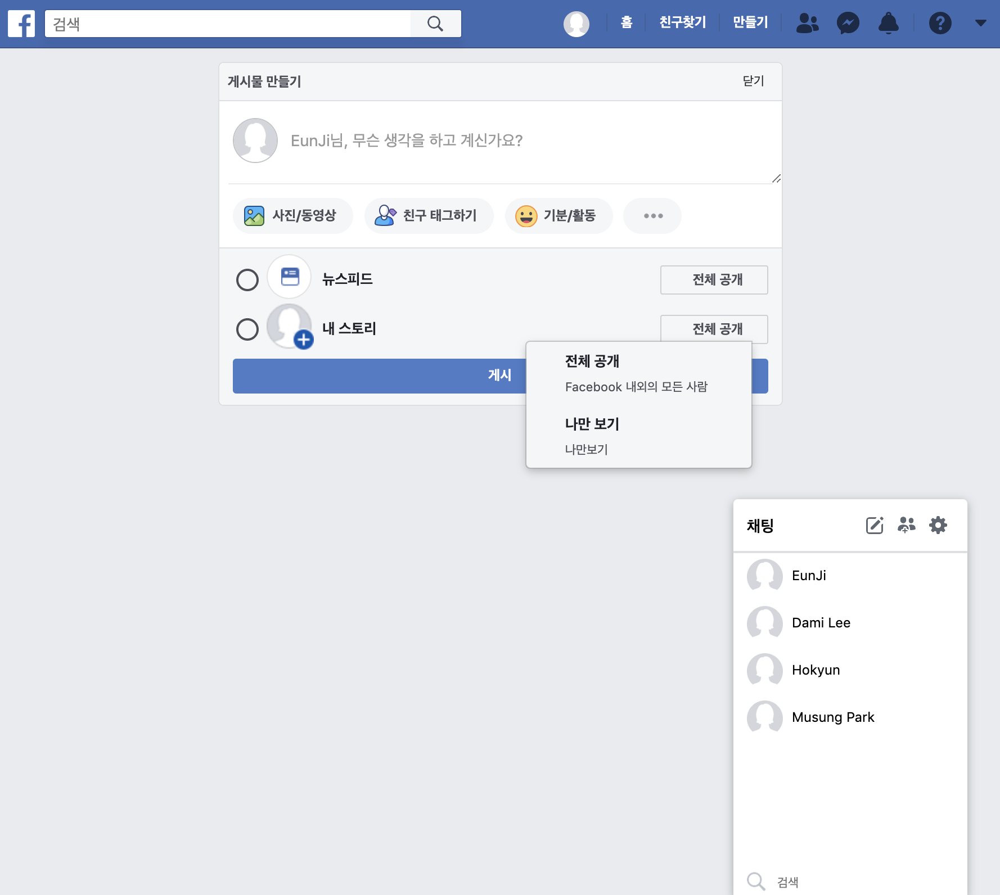

## Facebook front develop (REACT)
React Facebook SPA 구현 팀 프로젝트

>[페이스북 바로가기](https://www.facebook.com/)
 
>[프로젝트 바로가기](https://facebook-react.netlify.com)
 
>[깃허브 협업 저장소 바로가기](https://github.com/hogyun3709/facebook-collab)

 

### 개발도구
  - VScode
  - ReactJS
  - ES6
  - CSS3
  - Github

## 팀 프로젝트 목표 (2019.12.03 - )
- **협업을 위한 Github Study**
- **Facebook UI 구현**
- **ReactJS를 사용한 SPA 기획**
  - Frontend Framwork 입문
  - JSX, JS ES6 문법을 사용한 데이터 리스트업
  - CRUD (create, read, update, delete) 기능 구현
  - Component 구조, 재사용성, 데이터 상태관리에 대한 고려
  - API, LifeCycle에 관한 학습
  - Chatting 기능 구현

## 프로젝트 내용 (담당 포지션)
### 1. ReactJS
- **JSX, ES6 문법을 사용한 데이터 리스트업**
  - Arrow function, Array method map, filter 등 사용
- **CRUD (create, read, update, delete) 기능 구현**
  - 검색기록, 피드 및 댓글 수정 및 삭제, 친구 검색 기능 적용
- **랜더링 및 재사용성의 효율성을 위한 기능별 component 설계**
  - User, Comment component 재사용 적용

 

### 2. CSS3

- **Flex를 활용한 flexible layout**
- **Sprite img를 사용한 효율적인 이미지 렌더링**
- **hover, click 시 animation, tootip, pop over 효과**

 
 

***
### Study 참고자료
[ReactJS](https://reactjs-kr.firebaseapp.com)

[Velopert](https://velopert.com)
### 그 외 react study
[Github repository](https://github.com/eunji1117/React-Ringle-Study) 
(todo widget, clock widget, login api, sns feed construct)

 